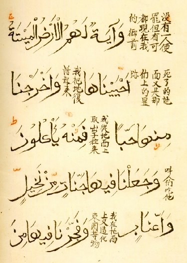
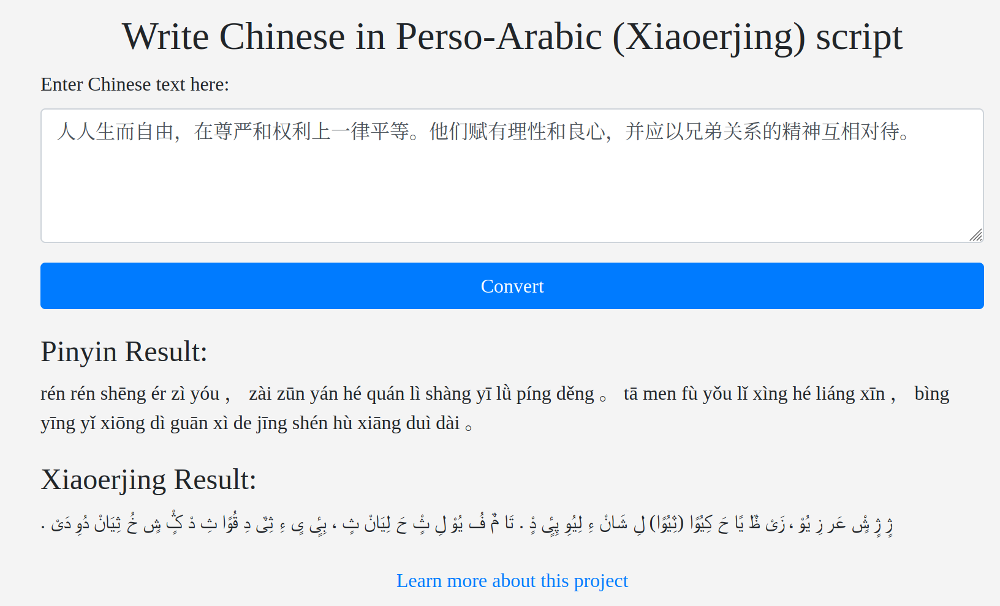

xinhui zidian (新回字典)
=======================

Try it out here! [https://marshesduck.pythonanywhere.com/](https://marshesduck.pythonanywhere.com/)



This tool writes Chinese characters in Perso-Arabic script. This style of writing is known as Xiaoerjing (小儿经, ثِیَوْ‎ عَر‎ ݣٍْ‎), and is used by the Hui Chinese Muslims in Northwest China. Islam in China has a deep history and I built this tool to celebrate and promote interest in the unique interchange of cultures and faiths on the Silk Road. 

To Run
========
This python app works as a flask server. Run the file convert_to_persoarabic.py and you'll be able to use the script locally from your browser.



FYI, the text used in the screenshot above is Article 1 of the Universal Declaration of Human Rights in Chinese, taken from [Wikipedia](https://en.wikipedia.org/wiki/Xiao%27erjing#Example). I've also included the text here below in case you want to copy and paste it. 

```人人生而自由，在尊严和权利上一律平等。他们赋有理性和良心，并应以兄弟关系的精神互相对待。```

Future plans
==============

Formatting enhancements:
----------

~~Support for formatting Arabic numbers.~~ Completed. 

~~Fix issues with parsing and formatting punctuation. In particular single and double quotes.~~ Will not fix. 

Add line breaks. 

Quality Control:
------------------

~~Presets so you can test the tool out without actually knowing Chinese. I wanted to include Article 1 of the Universal Declaration of Human Rights, the first sura of the Quran (both of these examples are used on the [Wikipedia](https://en.wikipedia.org/wiki/Xiao%27erjing#Example) page on this script) and a line from the [Han Kitab](https://en.wikipedia.org/wiki/Han_Kitab) (汉克塔布, هان کتاب), which is a unique text that blends Confucian and Islamic thought.~~ I put in presets for common Chinese words, in addition to a paragraph from the Tianfang Xingli, a famous Chinese Islamic text, and the Chinese word for halal. 

Accuracy:

I need to check the accuracy of my dictionary for converting Chinese into Perso-Arabic. The writing system was never standardized and it is difficult to find information about this script. The Wikipedia conversion table also contains omisisons (glaringly, it was missing the sound 'en', 恩) and sometimes sources online are in disagreement about the way to represent a sound. 

The ٿ issue: 

This is a unique Xiaoerjing letter to represent the sound 'q' in Mandarin. I am representing this sound using 'ک' in my tool, but I would like to add a toggle between these two representations. 

The shaddah sign:

In Xiaoerjing, the shaddah sign is used to represent a doubling of a Chinese word. It has the same usage as the Japanese iteration mark 々. I would like to create an advanced feature where if you type in the character 々 in the text box, it puts the shaddah sign on the previous word to double it. For example, 天天想吃鱼 (تِیًا‎ تِیًا‎ ثِیَانْ‎ چِ‎ یُوِ‎) can be written as 天々想吃鱼 to create (تِیًّا‎ ثِیَانْ‎ چِ‎ یُوِ‎). 

Exciting plans:
----------------

~~I also intend on hosting my own instance of this webapp on my personal website soon.~~ 

This is currently being hosted here: https://marshesduck.pythonanywhere.com/. 

I want to create a Chinese language version of this tool in the future if possible. (My Chinese is bad so this might not be possible.)

What's up with the repo name?
---------------------------------

The repo name - xinhui zidian (新回字典) is a pun on the name of the most famous dictionary in China - xinhua zidian (新华字典). The word hua (华) refers to the Han Chinese ethnicity, while hui (回) refers to Chinese Hui Muslims (Note: The Hui Muslims are distinct from the Uyghurs in Xinjiang). The Hui Chinese are a Mandarin-speaking ethnic group in China, centred around the province of Ningxia but prominent throughout Northwest China. They created this writing system to make Mandarin easier to read.  

