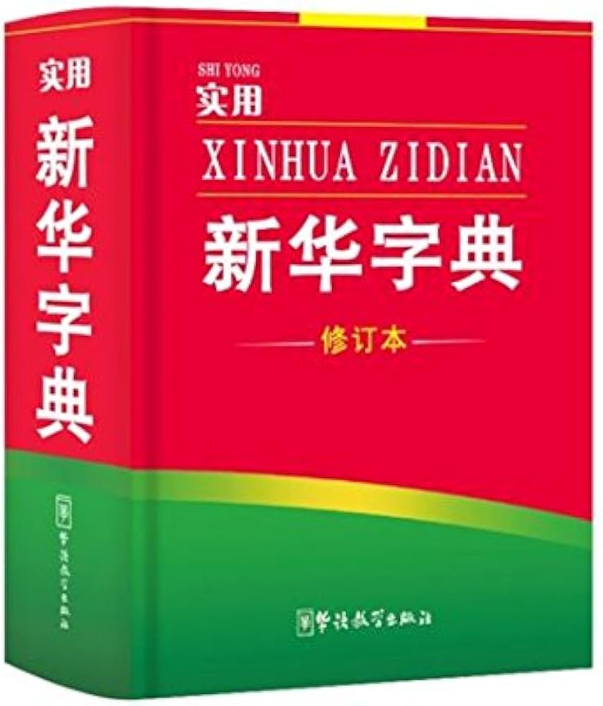
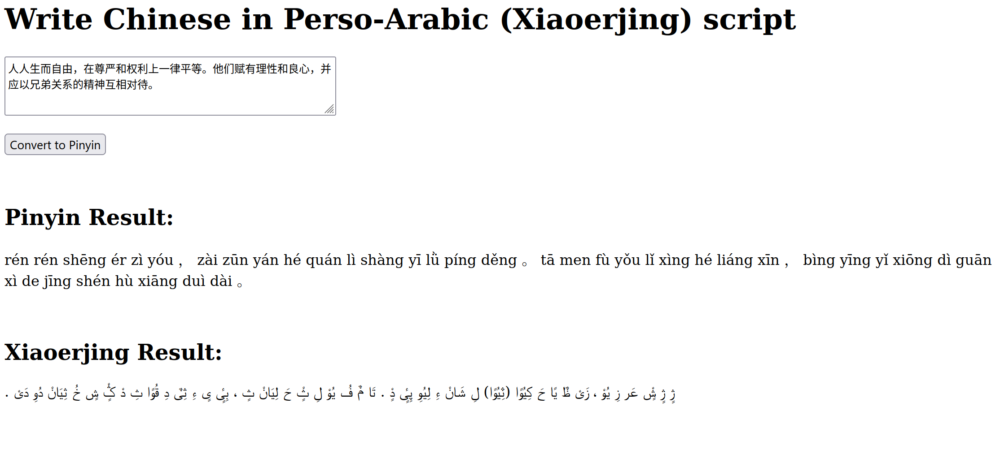

xinhui zidian (新回字典)
=======================

This tool writes Chinese characters in Perso-Arabic script. This style of writing is known as Xiaoerjing (小儿经, ثِیَوْ‎ عَر‎ ݣٍْ‎), and is used by the Hui Chinese Muslims in Northwest China. Islam in China has a deep history and I built this tool to celebrate and promote interest in the unique interchange of cultures and faiths on the Silk Road. 

The repo name - xinhui zidian (新回字典) is a pun on the name of the most famous dictionary in China - xinhua zidian (新华字典). The word hua (华) refers to the Chinese ethnicity, while hui (回) refers to Chinese Muslims. This way of writing Chinese using Perso-Arabic script originated from the Hui Chinese, and so this repository is named for them.  



To Run
========
This python app works as a flask server. Run the file convert_to_persoarabic.py and you'll be able to use the script locally from your browser.



FYI, the text used in the screenshot above is Article 1 of the Universal Declaration of Human Rights in Chinese, taken from [Wikipedia](https://en.wikipedia.org/wiki/Xiao%27erjing#Example). I've also included the text here below in case you want to copy and paste it. 

```人人生而自由，在尊严和权利上一律平等。他们赋有理性和良心，并应以兄弟关系的精神互相对待。```

Future plans
==============
Support for formatting Arabic numbers. 

Presets so you can test the tool out without actually knowing Chinese. I wanted to include Article 1 of the Universal Declaration of Human Rights, the first sura of the Quran (both of these examples are used on the [Wikipedia](https://en.wikipedia.org/wiki/Xiao%27erjing#Example) page on this script) and a line from the [Han Kitab](https://en.wikipedia.org/wiki/Han_Kitab) (汉克塔布, هان کتاب), which is a unique text that blends Confucian and Islamic thought. 

I need to check the accuracy of my dictionary for converting Chinese into Perso-Arabic. The writing system was never standardized and it is difficult to find information about this script. The Wikipedia conversion table also contains omisisons (glaringly, it was missing the sound 'en', 恩) and sometimes sources online are in disagreement about the way to represent a sound. 

I also intend on hosting my own instance of this webapp on my personal website soon. 
